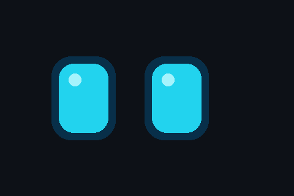

<!-- Синий EMO: смотрит по сторонам и моргает -->

# Hi, I'm compotik2 🤖

## 📊 Stats

## 🛠️ Stack

### 🚀 Current project
**Self-evolving Telegram bot** — учится командам `научись ...` и сам пишет код в `skills/`

💙 inspired by EMO

